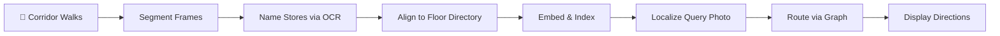

<div align="center">

# 🧭 InVision — Indoor Navigation System

**Navigate inside a shopping mall using just a photo of a shopfront.**


</div>

---

## 📌 Project Idea

GPS doesn't work indoors. Traditional indoor navigation solutions require expensive infrastructure like Bluetooth beacons, Wi-Fi fingerprinting, or digitized floor plans — none of which a typical shopping mall has.

**InVision** takes a different approach: it uses the **signage already on the walls**. A shopper photographs any storefront, and the system identifies their location using computer vision (CLIP + OCR), then provides turn-by-turn navigation to any destination in the mall — across floors, escalators, and gates.

```
📸 Photo → CLIP Embedding ─┐
                            ├→ Fused Score → Unit ID → Graph Route → Directions
📸 Photo → OCR Signage ────┘
```

---

## 🎯 Objectives

1. **Locate a shopper from a single photograph** — using only existing mall signage, with no beacons, Wi-Fi surveys, or instrumented floor plans.
2. **Fuse two independent recognition signals** — storefront visual appearance (CLIP) and signage text (OCR) — and measure the contribution of each.
3. **Report uncertainty honestly** — close calls are shown with alternatives rather than forcing a potentially wrong answer.
4. **Convert a printed floor directory into a routable graph** — enabling turn-by-turn directions across floors, escalators, and gates.
5. **Deliver a shopper-friendly interface** — one web page, no app install, with routes shareable as an image or text.
6. **Keep the project runnable without source photographs** — respecting the privacy terms under which images were captured.

---

## ✨ Key Features

| Feature | Description |
|---|---|
| 📍 **Photo-Based Localization** | Snap a shopfront photo → system identifies your location by fusing CLIP visual similarity with OCR text matching |
| 🗺️ **Turn-by-Turn Navigation** | Dijkstra-based routing over a 268-node graph covering all floors, escalators, and gates |
| 🗣️ **Voice Directions** | Directions are read aloud via text-to-speech — no need to stare at a screen while walking |
| 🛒 **Multi-Stop Trip Planner** | Add up to 8 stops; the system finds the optimal visit order using the Held–Karp algorithm |
| 📊 **Nearby Stores** | See what's within walking distance, ranked by actual walking distance (not straight-line) |
| 🔄 **Progress Check** | Take another photo mid-walk to see if you're still on track, or get a fresh route |
| 📋 **Share Routes** | Export your route as a PNG card, copy to clipboard, or use your phone's share sheet |
| 🔙 **Reverse Route & History** | One-tap route reversal; last 5 destinations saved locally in the browser |

---

## 🛠️ Technologies & Libraries

| Category | Technology | Purpose |
|---|---|---|
| **Language** | Python 3.11+ | All server-side logic |
| **Vision Model** | PyTorch, Transformers, `openai/clip-vit-base-patch32` | 512-dimensional storefront embeddings |
| **OCR** | `rapidocr_onnxruntime` | Extract signage text with bounding boxes for height-based ranking |
| **Graph** | `networkx` | Dijkstra routing, multi-stop tour optimization |
| **Numerics** | `numpy`, `Pillow` | Cosine similarity, image processing |
| **API** | `FastAPI`, `uvicorn`, `pydantic` | RESTful JSON API with photo upload |
| **Frontend** | HTML, CSS, JavaScript, inline SVG | Single-page interface — no build step, no framework, no CDN |

> Both models load lazily on first use. The server starts in ~1 second and only loads CLIP/OCR when a photo is submitted.

---

## 📐 How It Works (Methodology)

### Pipeline Overview



### Step-by-Step

| Step | What Happens | Key Files |
|---|---|---|
| **1. Capture** | Six corridor walks (3 floors × 2 sides), one burst per shopfront | `tools/extract_zips.py`, `src/ingest.py` |
| **2. Segment** | Split walks into runs of consecutive frames of the same shop using CLIP similarity | `src/grouping.py`, `src/pipeline.py` |
| **3. Name** | Identify each store from its tallest signage text, matched against brand vocabulary | `tools/find_brands.py` |
| **4. Align** | Match recovered stores to the printed floor directory (the ground truth) | `src/frame_align.py` |
| **5. Index** | Embed all gallery/query frames with CLIP; cache OCR output | `tools/embed_all.py`, `tools/ocr_all.py` |
| **6. Localize** | Fuse visual (0.7) + text (0.3) scores; legible signage can override | `src/localizer.py` |
| **7. Route** | Dijkstra over a 268-node walkway graph → turn-by-turn directions | `src/mall_graph.py` |
| **8. Serve** | FastAPI serves the API; the page renders SVG floor maps and reads directions aloud | `api.py`, `web/index.html` |

### Localization Details

- **Visual Channel:** Query photo is embedded with CLIP. Each store's score = best cosine similarity across its gallery vectors.
- **Text Channel:** RapidOCR extracts signage tokens ranked by text height (tallest = most likely brand name). Fuzzy matched against store names/aliases.
- **Fusion:** Default 0.7 visual + 0.3 text. If signage scores above 0.42, it overrides the visual channel entirely (a legible brand name is stronger evidence than visual similarity).
- **Confidence:** Results are marked "confident" when the margin over the runner-up is ≥ 0.03. Close calls show alternatives.

---

## 📊 Dataset

> **Custom-captured** for this project — no public dataset of shopfronts aligned to a floor directory exists.

| Metric | Value |
|---|---|
| Total frames ingested | 289 |
| Frames with legible signage | 288 |
| Stores recovered | 83 |
| Total directory units | 104 (across 5 floors) |
| Images per store | 1 min, 3 median, 14 max |
| Gallery split | 234 embeddings |
| Query split (held-out) | 55 embeddings |
| Embedding dimension | 512 |

### ⚠️ Why Photos Are Not Included

The photographs were captured with **written permission from mall management**, under terms that do not permit redistribution. The repository includes only **derived artifacts** (CLIP embeddings, OCR output, indexes) — not the source images. The 512-dimensional embeddings are sufficient to run and evaluate the system, and cannot reconstruct the original photos.

See `data/dataset/DATASET_CARD.md` for full format documentation.

---

## 📈 Results

Evaluated on the held-out query split (55 images, 83 recognizable stores, 104 total candidates):

| Configuration | Top-1 | Top-3 | Top-5 | Correct Floor |
|---|---|---|---|---|
| Visual only (CLIP) | 58.2% | 74.5% | 80.0% | 83.6% |
| Text only (OCR) | 58.2% | 63.6% | 65.5% | 74.5% |
| Fusion 0.5 / 0.5 | 60.0% | 72.7% | 76.4% | 78.2% |
| **Fusion 0.7 / 0.3** | **67.3%** | **80.0%** | **87.3%** | **87.3%** |
| Fusion 0.85 / 0.15 | 65.5% | 80.0% | 83.6% | 89.1% |

> **Key Finding:** Fusing both signals at 0.7/0.3 yields a **+9 point improvement** in top-1 accuracy over either channel alone. The text channel contributes most where the visual channel is weakest (e.g., similar-looking glass storefronts).

⚠️ *These numbers are optimistic — query images were captured near their gallery images under similar conditions. A fair evaluation needs photos from different days/lighting.*

```bash
python evaluate.py
```

---

## ⏱️ Performance Benchmarks

Median of 3 runs over 5 query photos, laptop CPU (no GPU), after model warm-up:

| Stage | Time | Notes |
|---|---|---|
| Build graph | 3.2 ms | 268 nodes, once at startup |
| Load gallery | 2.8 ms | Once at startup |
| Load CLIP | 24 s | First photo only (lazy) |
| Load RapidOCR | 6.9 s | First photo only (lazy) |
| Embed one photo | 492 ms | CLIP forward pass |
| Read signage | 3.5 s | RapidOCR |
| **Localize (end-to-end)** | **3.9 s** | Embed + OCR + score + fuse |
| Route between two stores | 0.76 ms | Dijkstra + written directions |
| Nearby search (45 m) | 0.06 ms | One capped sweep |
| Order 4-stop trip | 2.8 ms | Held–Karp (exact) |

---

## 🚀 Getting Started

### Prerequisites

- Python 3.11 or newer
- The pre-computed embeddings are already included in the repository — no photos needed

### Installation

```bash
# 1. Clone the repository
git clone https://github.com/shubham80patil/InVision-Indoor-Navigation.git
cd InVision-Indoor-Navigation

# 2. Install dependencies
pip install -r requirements.txt

# 3. Install PyTorch (CPU version is sufficient)
pip install torch --index-url https://download.pytorch.org/whl/cpu

# 4. Start the server
python api.py
```

### Usage

1. **Open** [http://127.0.0.1:8000](http://127.0.0.1:8000) in your browser
2. **Upload a shopfront photo** — drag & drop or paste from clipboard
3. **Search for a destination** — or pick from nearby stores
4. **Get directions** — view the route on the map, listen to voice directions, or share as an image

### Command Line

```bash
# Identify a shopfront
python predict.py shot.jpg --top-k 3

# Visual-only mode (no OCR)
python predict.py shot.jpg --no-text

# Route between stores
python route.py --from-store SWAROVSKI --to DECATHLON

# Route from a photo to a store
python route.py --from-photo shot.jpg --to DECATHLON
```

### Rebuilding the Dataset (requires your own photos)

```bash
python tools/extract_zips.py     # Unpack corridor walks
python tools/embed_all.py        # CLIP embeddings (cached)
python tools/ocr_all.py          # OCR output (cached)
python build_dataset.py          # Segment, recover stores, generate report
```

---

## 📁 Project Structure

```
InVision-Indoor-Navigation/
│
├── api.py                  # FastAPI web service (locate, route, tour, progress, review)
├── predict.py              # CLI: locate a shopfront from a photo
├── route.py                # CLI: route between stores
├── evaluate.py             # Run the ablation evaluation
├── build_dataset.py        # Reconstruct stores from corridor walks
├── requirements.txt        # Python dependencies
│
├── src/                    # Core modules
│   ├── localizer.py        # Fusion engine: CLIP + OCR → ranked units
│   ├── encoders.py         # Lazy-loaded CLIP & RapidOCR wrappers
│   ├── mall_graph.py       # Walkway graph, Dijkstra routing, tours, progress
│   ├── directory.py        # Floor directory loader with aliases
│   ├── pipeline.py         # Walk segmentation & store recovery
│   ├── grouping.py         # Brand token detection, run grouping
│   ├── frame_align.py      # Align recovered stores → directory units
│   ├── ingest.py           # Read capture folders
│   ├── build_stores.py     # Export processed dataset
│   └── config.py           # All paths & thresholds in one place
│
├── tools/                  # One-shot pipeline utilities
│   ├── extract_zips.py     # Unpack raw walks
│   ├── embed_all.py        # Batch CLIP embedding
│   ├── ocr_all.py          # Batch OCR processing
│   ├── find_brands.py      # Brand vocabulary extraction
│   ├── apply_directory.py  # Apply directory mappings
│   ├── export_dataset.py   # Export final dataset
│   ├── calibrate_threshold.py  # Tune fusion thresholds
│   ├── timings.py          # Performance benchmarking
│   └── probe_data.py       # Data inspection utility
│
├── web/                    # Frontend
│   ├── index.html          # Main UI (single page, no framework)
│   ├── review.html         # Label review interface
│   └── atrium.png          # Atrium reference image
│
└── data/
    ├── mall_directory.json  # 104 units with aliases (hand-entered)
    ├── derived/             # Embeddings, indexes, OCR output, reports
    └── dataset/             # Dataset card, labels, store metadata
```

---

## 🌐 API Reference

| Method | Endpoint | Description |
|---|---|---|
| `GET` | `/` | Main web interface |
| `GET` | `/api/stores` | List all routable directory units |
| `GET` | `/api/layout` | Floor geometry for SVG map rendering |
| `POST` | `/api/locate` | Upload a photo → get ranked store predictions with confidence |
| `POST` | `/api/route` | Get turn-by-turn directions between two stores |
| `POST` | `/api/tour` | Optimize and route a multi-stop trip (up to 8 stops) |
| `POST` | `/api/progress` | Check mid-walk progress against the current route |
| `GET` | `/api/nearby` | Find stores within a walking radius |
| `GET` | `/review` | Label review interface |
| `GET` | `/api/review` | Get all frames with current assignments |
| `POST` | `/api/review` | Save corrected label assignments |

---

## ⚠️ Known Limitations

- **Optimistic accuracy** — query images were captured near gallery images under similar conditions; real-world accuracy with different lighting/crowds would be lower.
- **No open-set rejection** — photos of ceilings, floors, or people will still return a "closest" store match.
- **Modeled distances** — storefront widths assumed equal (8 m); directions are reliable but meter/time values are estimates.
- **21 uncovered stores** — mostly on upper floors; they can be routed to but not recognized.
- **Inferred labels** — store names come from OCR, not manual verification; known OCR failures (e.g., `ESTSIDE` for Westside) exist.
- **No refit detection** — a shop that changes its signage becomes unrecognizable until recaptured.

---

## 🔮 Future Improvements

- **Sequence localization** — use 2-3 consecutive frames filtered through the adjacency graph to eliminate impossible jumps
- **Geometric verification** — SIFT/LoFTR keypoint matching with RANSAC to re-rank CLIP's top predictions
- **Open-set rejection** — refuse non-shopfront images instead of force-matching them
- **Landmark thumbnails** — show gallery images of landmarks in directions so shoppers can confirm they're on track
- **Robustness benchmark** — test with motion blur, glare, low light, and occlusion corruptions
- **Amenities routing** — add washrooms, lifts, exits, parking, and step-free routing for accessibility

---

## 💰 Cost

**Zero.** CLIP and RapidOCR run locally on CPU. The graph uses NetworkX. The API is FastAPI. The frontend is one HTML file. Nothing calls a paid API.

---

## 📄 License

See [LICENSE](./LICENSE) for details.
